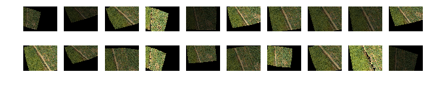

# Data Hack 
[https://git.asi.ru/remembername/datahacksd](https://git.asi.ru/remembername/datahacksd)

Сервис автоматизации процесса обработки аеро-(фото-) изображений сельхозяйственных полей, полученных с беспилотных летательных аппаратов, на основе применения сверточных нейросетей. 

- API сервис, загрузка, обработка изображения, получение результата
- Веб-сервис, прототип личного кабинета.

## Развертывание с Dockerfile:

### 1.1 Загрузить содержимое репозитория по ссылке

    D:\> git clone https://git.asi.ru/remembername/datahacksd.git

### 1.2 Сборка..

    D:\> cd datahacksd
    D:\datahacksd> docker build -t datahacksd .

### 1.3 ..и запуск

    D:\innApi> docker run --name datahacksd -p 3333:3333 -d datahacksd

## Attention! Как мы справились с недостатком данных:
### 1) "Гугл вам в помощь..", или "грамотный search" для DS всё
### 2) Keep, Calm and Аугментация !

Пример:




### 3) Немного магии и на выходе чуть более 900 изображений для 3х классов (Сорняки, Засуха, Отсутствие проблем) Profit!
Исходный код:    
```python
#importing some useful packages
import matplotlib.pyplot as plt
import matplotlib.gridspec as gridspec
import cv2
import os 

import numpy as np
%matplotlib inline
import matplotlib.image as mpimg
def augment_brightness_camera_images(image):
    image1 = cv2.cvtColor(image,cv2.COLOR_RGB2HSV)
    random_bright = .25+np.random.uniform()
    #print(random_bright)
    image1[:,:,2] = image1[:,:,2]*random_bright
    image1 = cv2.cvtColor(image1,cv2.COLOR_HSV2RGB)
    return image1

def transform_image(img,ang_range,shear_range,trans_range,brightness=0):
    '''
    This function transforms images to generate new images.
    The function takes in following arguments,
    1- Image
    2- ang_range: Range of angles for rotation
    3- shear_range: Range of values to apply affine transform to
    4- trans_range: Range of values to apply translations over.

    A Random uniform distribution is used to generate different parameters for transformation

    '''
    # Rotation

    ang_rot = np.random.uniform(ang_range)-ang_range/2
    rows,cols,ch = img.shape    
    Rot_M = cv2.getRotationMatrix2D((cols/2,rows/2),ang_rot,1)

    # Translation
    tr_x = trans_range*np.random.uniform()-trans_range/2
    tr_y = trans_range*np.random.uniform()-trans_range/2
    Trans_M = np.float32([[1,0,tr_x],[0,1,tr_y]])

    # Shear
    pts1 = np.float32([[5,5],[20,5],[5,20]])

    pt1 = 5+shear_range*np.random.uniform()-shear_range/2
    pt2 = 20+shear_range*np.random.uniform()-shear_range/2

    # Brightness


    pts2 = np.float32([[pt1,5],[pt2,pt1],[5,pt2]])

    shear_M = cv2.getAffineTransform(pts1,pts2)

    img = cv2.warpAffine(img,Rot_M,(cols,rows))
    img = cv2.warpAffine(img,Trans_M,(cols,rows))
    img = cv2.warpAffine(img,shear_M,(cols,rows))

    if brightness == 1:
      img = augment_brightness_camera_images(img)

    return img
```


```python
from tqdm import tqdm
gs1 = gridspec.GridSpec(10, 10)
gs1.update(wspace=0.01, hspace=0.02) # set the spacing between axes.
plt.figure(figsize=(12,12))
for d, dirs, files in os.walk('./sample_data/zasorennost/'): 
    pass
for file in tqdm(files):
    image = mpimg.imread('./sample_data/zasorennost/'+file)
    for i in range(16):
        #ax1 = plt.subplot(gs1[i])
        #ax1.set_xticklabels([])
        #ax1.set_yticklabels([])
        #ax1.set_aspect('equal')
        img = transform_image(image,20,10,5,brightness=1)

        #plt.subplot(10,10,i+1)
        #plt.imshow(img)
        #plt.axis('off')
        cv2.imwrite('./aug/zasorennost/'+file+str(i)+'.jpg',img)

   # plt.show()
```